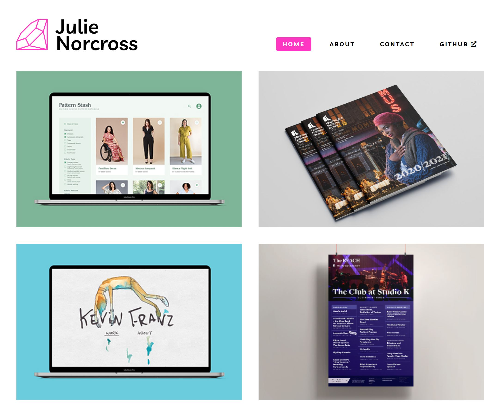
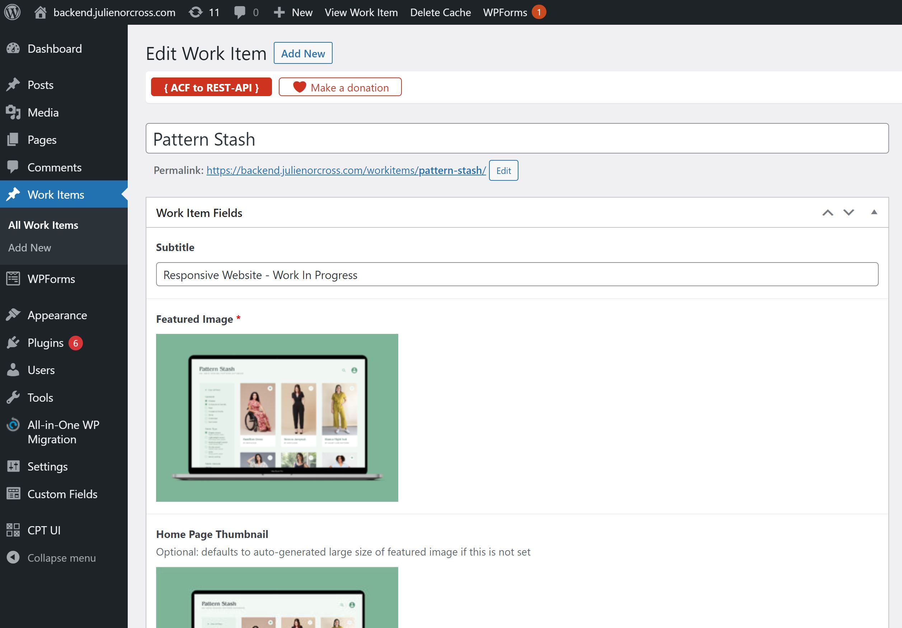
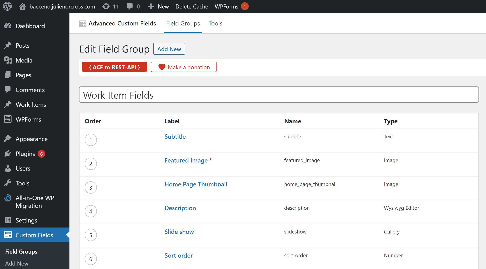

# julienorcross.com

https://www.julienorcross.com

## Frontend

- React
- create-react-app
- React Router
- React hooks
- JavaScript
- CSS Grids/Flexbox
- Sass

## Backend

- Wordpress as a headless CMS
- Wordpress plugins:
    - ACF to REST API
    - Advanced Custom Fields
    - Advanced Custom Fields: Gallery Field
    - Custom Post Type UI
- Github Actions to automate builds & FTP deploys

## Stay tuned...

- Dark mode
- Styled-components
- TypeScript
- Static Site Generation with Gatsby
- GraphQL
- MDX
- Netlify